  

<h1 align="center">Hi, I'm Ram Nanduri</h1>

  Bioinformatics developer working with genomics, clinical diagnostics, and research software.

  <a href="https://ramsainanduri.io">Website</a> ·
  <a href="https://linkedin.com/in/ramsainanduri">LinkedIn</a>

---

### About me

I am a bioinformatics developer based in Lund, Sweden. I work with genomic data to study disease-related variation and help translate sequencing results into evidence that can be interpreted and used in a clinical setting.

My work involves examining patterns in DNA and RNA sequencing data, assessing their technical and biological plausibility, and developing methods to make the analysis more reliable. I am particularly interested in cancer genomics, variant interpretation, quality control, and the validation of computational approaches.

I also develop the software needed to support this work from reproducible analysis workflows to applications that help researchers and clinical teams explore, review, and report genomic findings. This means moving regularly between biological questions, computational methods, and software engineering.

### Areas I work in

- Cancer genomics and clinical sequencing
- DNA and RNA variant analysis
- Variant interpretation and reporting
- Workflow development and validation
- Research and clinical software development

### Technical work

I primarily use **Python** for analysis and backend development, and **Nextflow** or **Snakemake** for reproducible workflows. For user-facing applications, I work with **TypeScript and React**. My development environment also includes databases, containers, Linux, HPC systems, testing, and CI/CD.

---

### GitHub activity

  <picture>
    <source media="(prefers-color-scheme: dark)" srcset="./profile/stats-dark.svg">
    <source media="(prefers-color-scheme: light)" srcset="./profile/stats-light.svg">
    
  </picture>
  <picture>
    <source media="(prefers-color-scheme: dark)" srcset="./profile/languages-dark.svg">
    <source media="(prefers-color-scheme: light)" srcset="./profile/languages-light.svg">
    
  </picture>

Statistics are generated from public GitHub activity and refreshed automatically.
